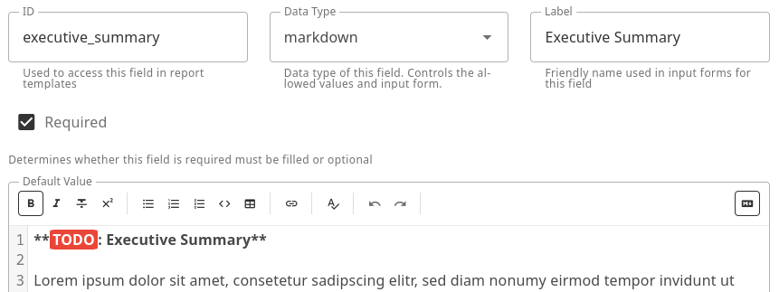
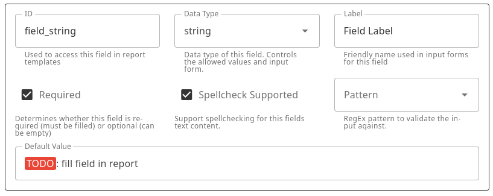
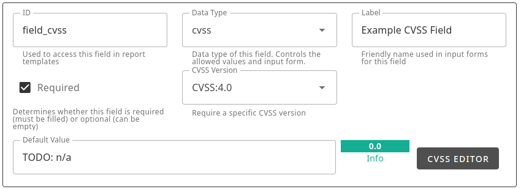
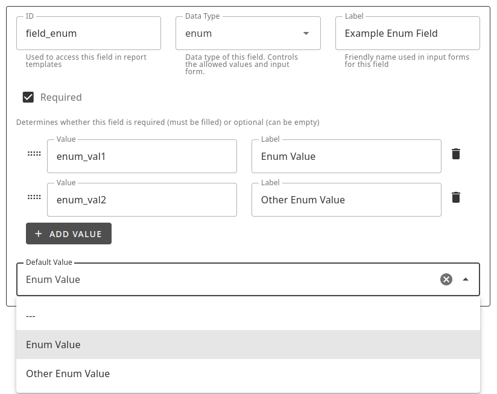
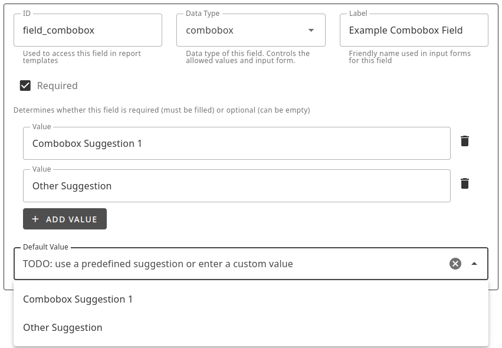
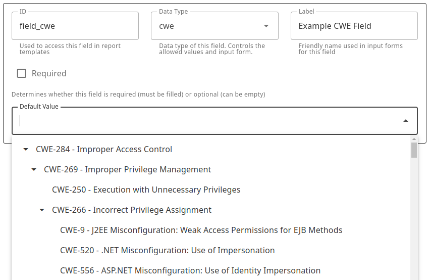
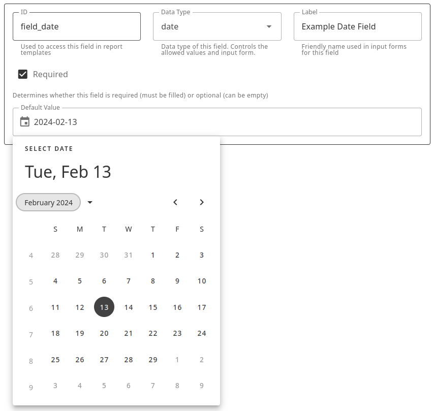
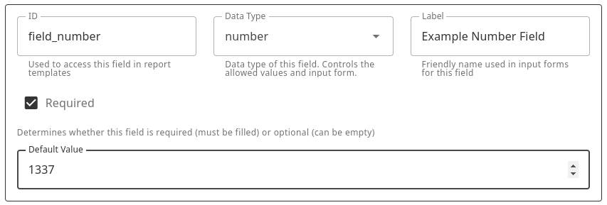
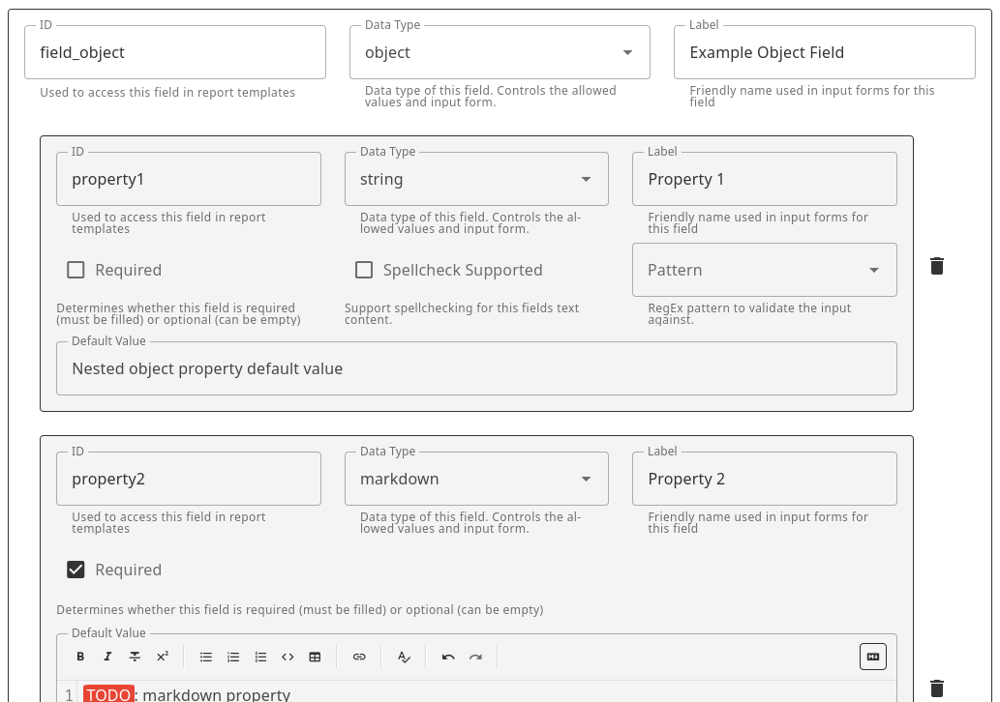
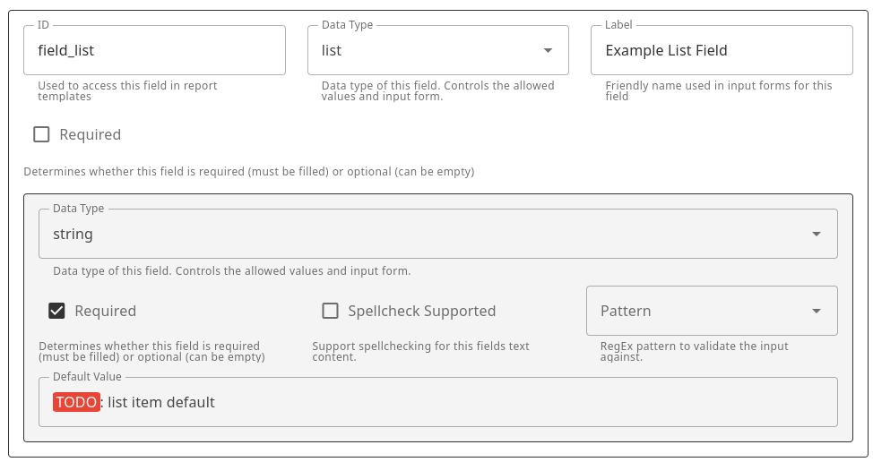

# Report Field Types

This page describes field types available in SysReptor and how to use them in reports and findings. 

Report and finding definitions define what input fields are available in report sections and findings when writing report. 
Fields are available as form input fields when writing reports in the web interface.
Field values are also available in Vue templates as variables.


## Common Options
All fields have the following common options:

* ID: A unique identifier for the field. This ID is used to access the field in the HTML/Vue template.
* Data Type: The data type defines the structure of the field and its allowed values. See below for a list of available data types.
* Label: The label is shown in the input form when writing a report. It is a friendly name for users to understand what the field is for.
* Required: Mark the field as required (must be filled) or optional (can be empty). If a required field is not filled out, a warning message generated before publishing the report.
* Default Value: The default value is the initial value of the field when creating a new project. Some fields support TODOs in the default value to remind the user to fill out parts of the field.


## Markdown
Markdown fields are used to write text blocks with markdown formatting.
See [Markdown Syntax](../reporting/markdown-features.md) for more information on markdown formatting.



```html title="Usage in Vue templates"
<markdown :text="report.field_markdown" />
```

## String
String fields are used to write a short, single-line text.
Compared to markdown fields, only a single line is allowed and no text formatting is available.

Options:

* Spellcheck Supported: Enable or disable spellcheck for the field. Spellchecking is only useful for fields containing natural language text (e.g. a sentance, like for `short_description`). It is not useful for fields containing URLs, IDs, codes or other non-natural language text.
* Pattern: Regex pattern to validate the input. If the input does not match the pattern, a warning message is generated before publishing the report.



```html title="Usage in Vue templates"
Text: {{ report.field_string }}
```


## CVSS
CVSS fields are used to write a CVSS vector. A graphical CVSS vector editor is available in the input form.

Options:

* CVSS Version: Require a specific CVSS version (CVSS:3.1 or CVSS:4.0) or allow both versions.




The field content is a CVSS vector string or "n/a" to indicate that no CVSS vector is applicable.
The CVSS score is calculated from the vector and shown in the input form and provided in Vue templates.

```html title="Usage in Vue templates"
Vector: {{ report.field_cvss.vector }}
Score: {{ report.field_cvss.score }}
Level: {{ report.field_cvss.level }} <!-- "critical", "high", "medium", "low", "info" -->
Level (numeric): {{ report.field_cvss.level_number }} <!-- 5, 4, 3, 2, 1 -->
CVSS Version: {{ report.field_cvss.version }} <!-- "3.1", "4.0" -->
```


## Enum
Enum fields are used to select a single value from a list of predefined options.

Options:

* Choices: A list of options to choose from. Each option has a value and a label. The value is used as the field value and the label is shown in the input form.



```html title="Usage in Vue templates"
Value: {{ report.field_enum.value }}
Label: {{ report.field_enum.label }}
```


## Combobox
Combobox fields are a combination of an enum field and a string field. The user can select a predefined option or enter a custom value.

Options:

* Suggestions: A list of predefined texts to choose from.



```html title="Usage in Vue templates"
Text: {{ report.field_combobox }}
```


## CWE
CWE fields are used to select a CWE (Common Weakness Enumeration).
This field is similar to an enum field, but provides more information about CWEs and enhanced search capabilities.



```html title="Usage in Vue templates"
ID: {{ report.field_cwe.id }} <!-- 284 -->
Value: {{ report.field_cwe.value }} <!-- "CWE-284" -->
Name: {{ report.field_cwe.name }} <!-- "Improper Access Control" -->
Description: {{ report.field_cwe.description }} <!-- "The software does not restrict or incorrectly restricts access to a resource from an unauthorized actor." -->
```

## Date
Date fields are used to select a date. A date picker is available in the input form.



Dates are stored in ISO 8601 format (YYYY-MM-DD). In Vue templates, the date can be formatted using the [`formatDate()` function](../designer/formatting-utils.md#date-formatting).

```html title="Usage in Vue templates"
ISO Date: {{ report.field_date }} <!-- 2024-02-13 -->
Formatted Date: {{ formatDate(report.field_date, 'long', 'en-US') }} <!-- February 13, 2024 -->
```


## Number
Number fields are used to enter a numeric value.



```html title="Usage in Vue templates"
Value: {{ report.field_number }}
```


## Boolean
Boolean fields are used to select a true or false value. This field is represented as a checkbox in the input form.


This field is useful enable/disable parts of the report rendering or change the behavior of the report template.
Booleans values are often combined with `v-if` and `v-else` directives in Vue templates to conditionally render parts of the report.

```html title="Usage in Vue templates"
Value: {{ report.field_boolean }}
If: <div v-if="report.field_boolean">...</div><div v-else>...</div>
```


## User
User fields are used to select a user from the list of project members.
In the Vue template the whole user object is available with the user's ID, name, email, phone number, etc.


```html title="Usage in Vue templates"
ID: {{ report.field_user.id }}
Name: {{ report.field_user.name }}
Email: {{ report.field_user.email }}
Full Data: <pre><code>{{ report.field_user }}</code></pre> <!-- 
{
  "id": "27a04015-353f-4237-8c71-f297c8395ad5",
  "name": "John Doe",
  "email": "john.doe@example.com",
  "phone": "+43 1234 5678",
  "mobile": "+43 1234 5678",
  "title_before": null,
  "first_name": "John",
  "middle_name": null,
  "last_name": "Doe",
  "title_after": null,
  "roles": ["lead", "pentester"]
}
-->
```


## Object
Object fields are used to group multiple fields together. This is useful to structure complex data in the report.

Options:

* Properties: A list of nested fields that are part of the object. Properties can have any data type.



```html title="Usage in Vue templates"
Property value: {{ report.field_object.property1 }}
Property value: {{ report.field_object.property2 }}
```


## List
List fields are used to dynamically add multiple values of a specific data type.

Options:

* Item Type: The data type of the list items. The item type can be any data type, including other lists or objects.



```html title="Usage in Vue templates"
List length: {{ report.field_list.length }}
List item by index: {{ report.field_list[0] }}
Iterate over list items: <div v-for="item in report.field_list">{{ item }}</div>
```

