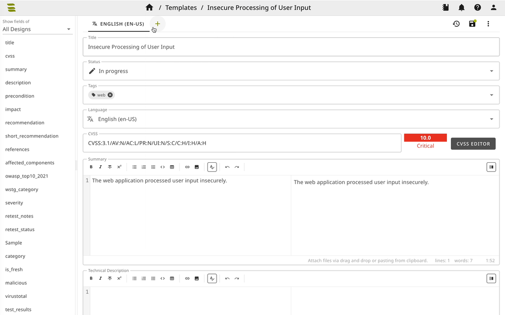

# Multilingual templates
Templates can contain texts for multiple languages.
This enabled you to manage all data of a template in one place even when it is translated in multiple languages. 

Each template has a (required) main language and (optionally) multiple translations.
The main language defines all fields that are required in the template (e.g. title, cvss, description, recommendation, references, etc.).
Translations can override language-specific fields (e.g. title, description, recommendation, etc.).
Fields that are not overridden are inherited from the main language (e.g. cvss, references).

This approach allows for maximum flexibility in template translations, since you can translate each field separately for each language.

Consider following scenario: 

You are writing a template in English, German and Dutch, where English is the main language and German and Dutch are translations.
In the English template you fill the text fields for title, description and recommendation with vulnerability descriptions (and some TODO markers to insert screenshots and pentest project specific details). Additionally you define the language-independent fields CVSS and references.

In the German and Dutch translations you only translate the title, description and recommendation fields need to be translated. 
The CVSS and references fields are inherited from the English template.

Let's consider you have found a great blog post describing the vulnerability in detail and want to use it as a reference in your report.
However, the blog post is only available in German, so you cannot use the for the English and Dutch template.
It is still possible to use them just for the German translation, by overriding the references field in the German translation.
The Dutch translation still inherits the English references, but the German translation contains the additional reference.