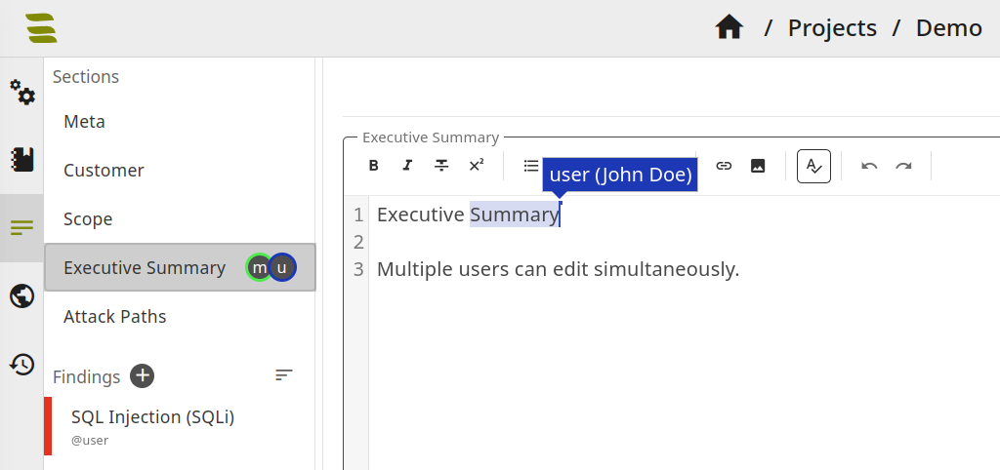

# Collaborative Editing
:octicons-heart-fill-24: Pro only

Collaborative editing allows multiple pentesters to simultaneously work on the same finding, section or note.
Changes are synchronized in real-time, so you can see what others are typing.

<figure markdown>
  
  <figcaption>Collaborative Editing</figcaption>
</figure>

## HTTP Fallback
Collaborative editing uses WebSockets for real-time communication. 
If no WebSocket connection can be established (e.g. because your network blocks WebSocket connections or your reverse proxy is not configured propertly yet), we fall back to HTTP polling.

HTTP Polling has higher delays than WebSockets and transmitting user's cursor positions is disabled.

We recommend to fix your network or reverse proxy configuration to use WebSockets for a better user experience.