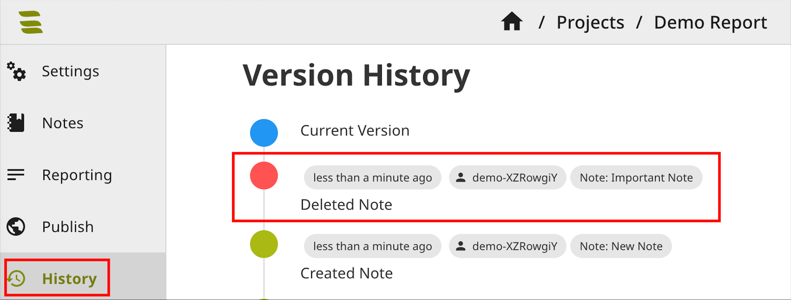

# Version History
:octicons-heart-fill-24: Pro only

The Version History allows you to view previous versions of objects (such as Projects, Findings, Notes, Templates, Designs) and shows you who made changes and when. (Personal notes do not have a version history.)

<figure markdown>
  { width="449" }
  <figcaption>Version History of Finding</figcaption>
</figure>

New versions are created time-based and action-based.

Action-based versions are created when fields change that have a bigger impact on the state of the saved object. For example when:

* an object is created or deleted
* a project is marked as finished
* the project design changes or
* the status or assignee of an object changes

Time-based versions are created with every save operation. A scheduled task then cleans up the versions so that there is one version for about every two hours. When users pauses for longer, the last state of their changes are saved. If other users make changes in the meantime, it is still possible to view the object at the time where the first user left off.

## Deletion
If you delete a finding or a note in a project, the version history is preserved. You can access deleted items in the project overview.

<figure markdown>
  { width="688" }
  <figcaption>Access deleted note</figcaption>
</figure>

However, if you delete a Project, Design or Finding Template, the history is deleted either.

## Exports
If you export an object (e.g. a project) it does not include the version history. This is to prevent unintended leaks of sensitive information and to reduce the file size of exported objects.

This means that if you export and re-import a project, it will no longer have a version history (but the original project will).

## Encrypted Archiving
If projects are [archived](../insights/archiving.md){ target=_blank }, the version history is deleted.  

## Backups
[Backups](../setup/backups.md){ target=_blank } include the version history. If a backup is restored, the version history is either.
